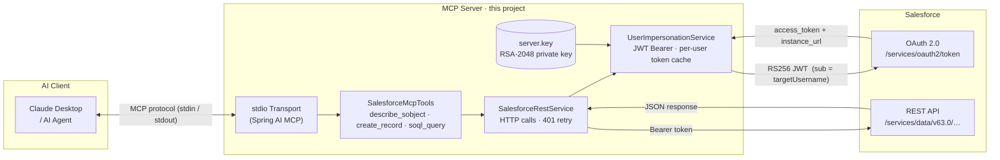
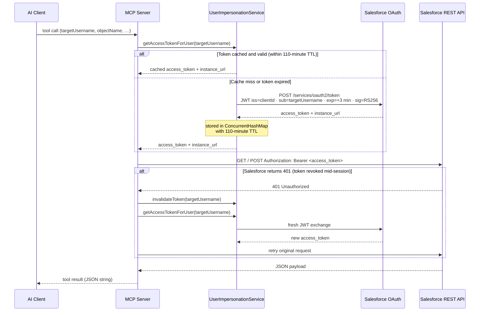

# Salesforce MCP Server

A **Spring Boot MCP (Model Context Protocol) server** that exposes Salesforce REST API operations to AI clients such as Claude Desktop.
It communicates over **stdin/stdout** — there is no HTTP port.
AI clients send tool calls over the MCP protocol and receive JSON responses, while the server handles all Salesforce OAuth and REST API plumbing transparently.

---

## Architecture



---

## Request Flow

Every MCP tool call goes through this sequence.
The token cache means Salesforce is only contacted for a new token once per user per ~110 minutes.



---

## MCP Tools

| Tool | Parameters | Description |
|---|---|---|
| `describe_sobject` | `targetUsername`, `objectName` | Returns the full schema of a Salesforce SObject — field names, types, createable/updateable flags. |
| `create_record` | `targetUsername`, `objectName`, `fieldsJson` (JSON object) | Validates fields against the describe result, then creates a new record. Returns the new record ID. |
| `soql_query` | `targetUsername`, `objectName`, `fieldsJson` (JSON array of field names) | Runs `SELECT <fields> FROM <object>` and returns all matching records. |

`targetUsername` is the Salesforce user the integration account impersonates for each call.
The server signs a fresh JWT with `sub = targetUsername`, exchanges it for an access token, and executes the REST call as that user.

---

## Salesforce Org Prerequisites

> Complete these steps **once** in your Salesforce org before running the server.

### 1 — Generate an RSA key pair

```bash
# Generate a 2048-bit private key
openssl genrsa -out server.key 2048

# Generate the self-signed public certificate (valid 10 years)
openssl req -new -x509 -key server.key -out server.crt -days 3650 \
  -subj "/CN=sfdc-mcp-server"
```

Place `server.key` at the path configured by `salesforce.private-key-path` in `application.properties`.
Keep the private key out of version control.

### 2 — Create a Connected App

1. Go to **Setup → Apps → App Manager → New Connected App**.
2. Fill in **Connected App Name** and **Contact Email**.
3. Under **API (Enable OAuth Settings)**:
   - Check **Enable OAuth Settings**.
   - Set **Callback URL** to `https://login.salesforce.com/services/oauth2/success` (not used, but required).
   - Add OAuth scopes: **Manage user data via APIs (api)** and **Perform requests at any time (refresh_token, offline_access)**.
   - Check **Use digital signatures** and upload `server.crt`.
4. Save.
   Salesforce may take 2–10 minutes to activate the new Connected App.

### 3 — Configure the Connected App policy

After the Connected App is saved:

1. Go to **Setup → Apps → App Manager**, find the app, click **Manage**.
2. Click **Edit Policies**.
3. Set **Permitted Users** to `Admin approved users are pre-authorized`.
4. Save.

This setting is required for the JWT Bearer OAuth flow.

### 4 — Authorize users for impersonation

Each Salesforce user the MCP server will impersonate (i.e. every value ever passed as `targetUsername`) must be pre-authorized:

1. On the Connected App's **Manage** page, scroll to the **Profiles** section.
2. Click **Manage Profiles**.
3. Add the **Profile** assigned to each user that will be impersonated.
4. Save.

> **Tip:** Assign users to a single shared profile (e.g. a dedicated "MCP Users" profile) to keep this list manageable.

### 5 — Note the Consumer Key

1. Go to **Setup → Apps → App Manager**, find the app, click **View**.
2. Copy the **Consumer Key** value.
3. Set it as `salesforce.client-id` in `application.properties`.

---

## Configuration

All settings live in `src/main/resources/application.properties`:

```properties
salesforce.org-url=https://<your-org>.my.salesforce.com
salesforce.client-id=<Consumer Key from Connected App>
salesforce.integration-username=<integration-user@your-org.com>
salesforce.private-key-path=/absolute/path/to/server.key
salesforce.api-version=v63.0
```

`salesforce.integration-username` identifies the Connected App owner in Salesforce audit logs.
It is **not** the user executing API calls — that is determined per tool call via `targetUsername`.

---

## Building and Running

```bash
# Build
./mvnw clean package

# Run (MCP server connects via stdio — attach to an AI client, not a terminal)
./mvnw spring-boot:run
```

Console logging is suppressed so it does not corrupt the stdio MCP stream.
All logs go to `./logs/mcp-server.log`.

### Connecting to Claude Desktop

Add the following to your Claude Desktop `claude_desktop_config.json`:

```json
{
  "mcpServers": {
    "salesforce": {
      "command": "java",
      "args": ["-jar", "/path/to/sfdcmcpsrv-0.0.1-SNAPSHOT.jar"]
    }
  }
}
```

---

## Testing

### Smoke test (no Salesforce connection required)

```bash
./mvnw test
```

Verifies the Spring context loads and all beans wire up correctly.

### Integration tests (live Salesforce org)

1. Open `src/test/resources/application-test.properties`.
2. Set `salesforce.test-username` to a Salesforce user whose profile is pre-authorized on the Connected App (see [Step 4](#4--authorize-users-for-impersonation) above).
3. Run:

```bash
# All integration tests
./mvnw test -Dspring.profiles.active=test

# Single entity
./mvnw test -Dtest=AccountMcpToolsIntegrationTest  -Dspring.profiles.active=test
./mvnw test -Dtest=ContactMcpToolsIntegrationTest  -Dspring.profiles.active=test
```

Tests auto-skip (reported as skipped, not failed) when `salesforce.test-username` is blank.

> **Note:** Each integration test run creates real records in Salesforce.
> Periodically delete records whose `Name` starts with `MCP` in your test org.

---

## Stack

| Layer | Technology |
|---|---|
| Language | Java 25 |
| Framework | Spring Boot 4.1.0 |
| MCP transport | Spring AI 2.0.0 (`spring-ai-starter-mcp-server`) |
| Salesforce auth | JWT Bearer OAuth 2.0 (JJWT 0.11.5, RS256) |
| HTTP client | `java.net.http.HttpClient` (JDK built-in) |
| JSON | Jackson 2.15 |